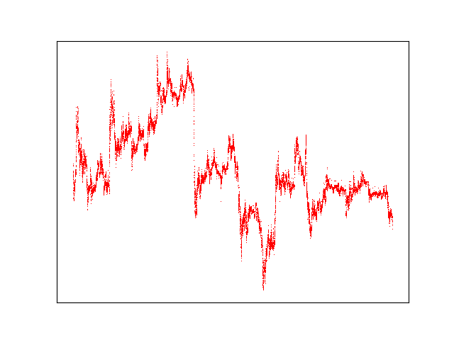
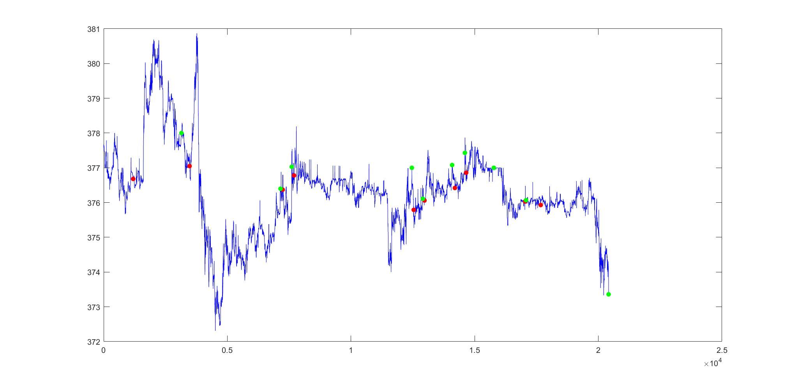
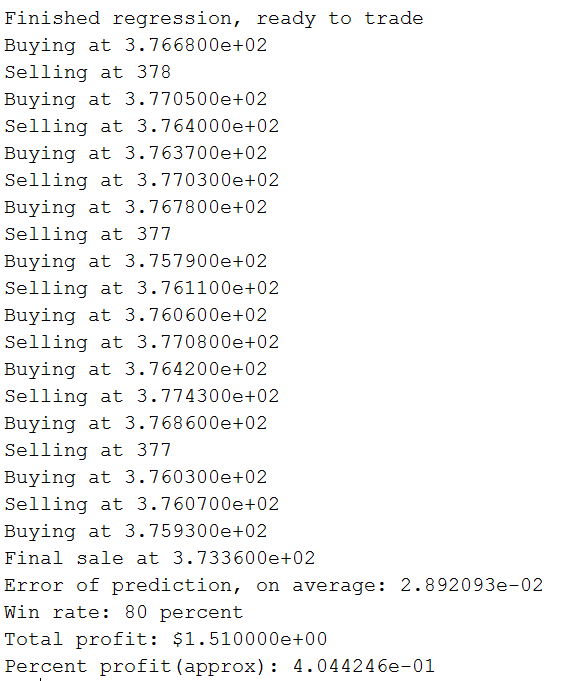
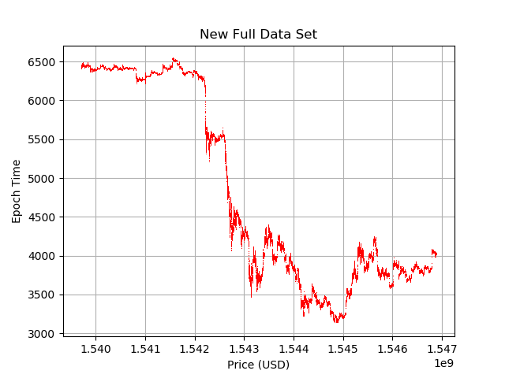
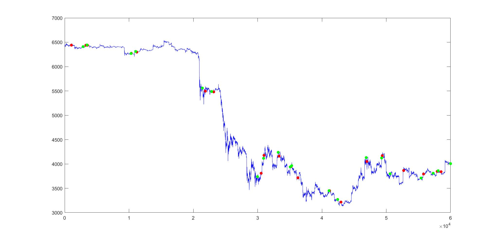
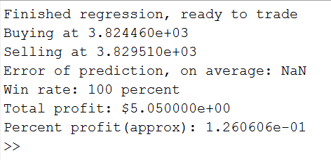

# Machine Learning ECE 4824 Final Project Team 12
### Authors: Zackery Frazier, Brandon Cheung, and John Zartman

### Orginial Paper Results

The paper which we attempted to implament was Bayesian regression and Bitcoin paper
written by Devavrat Shah and Kang Zhang(https://arxiv.org/pdf/1410.1231v1.pdf). 

We built off of an existing attempted implamentation of this paper which was hosted
on a github repository located at (https://github.com/panditanvita/BTCpredictor).

The paper was about using Bayesian Regression to predict fluxuations in the bitcoin market.

The implamentation of this paper reported that it was able to correctly predict the movement
of the bitcoin market approximately 80% of the time.

### Procedures

In order to try and reproduce the findings of the paper and implamentation we used the existing 
implamention, and trained and tested the model with an updated data set.

Our data set.....

We produced this data set by....

After we obtained and properly formatted the data set we procided to run the data set and...

## Original

### Original Results

**Figure 1** - Full data set used in the original experiment

**Figure 2** - The resulting graph from the original experiment

**Figure 3** - The results from the original experiment

## Reproduction

For this project we decided that would would try to recreate the results of the original paper of having a 1.1% profit and approximately an 80% "win percentage". In our original project proposal we planned to use two year worth of bitcoin market data at ten minute intervals, and training using the  

### Reproduction Results

**Figure 4** - Full data set the we used for our experiment

**Figure 5** - The resulting graph from the new experiment

**Figure 6** - The results from the new experiment

### Analysis

We were able to sucessfuly replicate the finding of the original paper and implamentation.

As you can see below in figures 3 and 6 below our new data set was able to perform better
than the original data set. We were able to get a higher sucess rate, and a higher total
profit than the was previously available.

We speculate that this was due to the less erratic movement of the bitcoin market. As you
can see in figure 1 the orignial data was highely volatile and seemed to jump almost 
randomly as the epochs increased. While the new data also has some large jumps it tends to
be more smooth and generally tended to follow more of a pattern than the previous data, 
as seen in figure 4 below.

It is worth noting however, that the program only attempted a sigle transaction on the
new data set. We are currently unaware of this change though this could have to ddo with
the fall of bitcoin in recent months.

### Relevent Papers

While working on this project we read and referenced several papers including...

