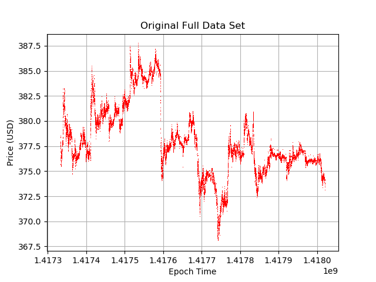
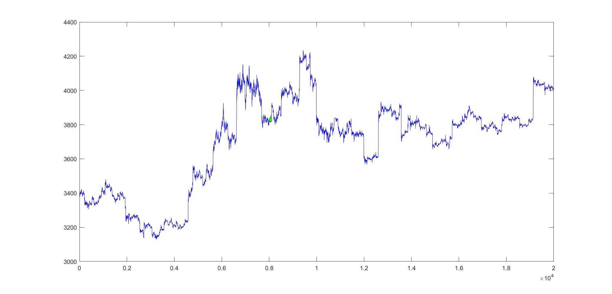

# Machine Learning ECE 4824 Final Project Team 12
### Authors: Zackery Frazier, Brandon Cheung, and John Zartman

## Objective
We attempted to replicate the results described in the paper ["Bayesian regression and Bitcoin"](https://arxiv.org/pdf/1410.1231v1.pdf) by Devavrat Shah and Kang Zhang. 

The paper describes Bayesian regression and its effectiveness for predicting variations in
the price of Bitcoin. 
Bayesian regression is defined as the utilization of empirical
data to perform Bayesian inference. Bayesian regression for "latent source
model", which is described in another report referenced in the paper, is
utilized for binary classification, but in the paper they attempt to use it to
predict the value of a Bitcoin. They make a bold claim that the strategy laid
out in the paper is capable of doubling an investment in less than 60 days when
run with real data.

## Procedure
In order to try and reproduce the findings of the paper, we built off of an existing attempted implementation hosted on [Anvita Pandit's GitHub page](https://github.com/panditanvita/BTCpredictor). This implemenatation is reported to correctly predict a price change 80% of the time. We then trained and tested the model with an updated data set. For this project we tried to recreate the results of the implementation of a 1.1% profit and approximately an 80% "win percentage".

Our data set used the same amount of data points as the original paper (I.E. 120,000 points). The two main differences between the data set that we used and the one used in the original paper was the cryptocurrency exchange used to obtain the pricing, and the time interval between data points. In the original paper they pulled their data from the cryptocurrency exchange [OKCoin](https://www.okcoin.com/), and we used [Coinbase](https://www.coinbase.com/). Also, in the original paper there was a five second interval between each of the data points, but our data set has one minute between data points. This leads to our data spanning a larger amount of time than the original data set.

To produce our data set we pulled [price data from coinbase](https://www.kaggle.com/mczielinski/bitcoin-historical-data). This data was for every minute from the beginning of the crypto's life in 2014 through present day. We then used simple unix commands to grab the last 120,000 lines of the data file. The data contained a lot of information including the pricing data at the opening of the minute and at the closing of the minute. We chose to use the opening prices as our price data point and stayed consistent with that choice through the rest of the experiment.

The next thing we did was write a short python script to graph the entire data set of the original paper and our entire data set. This was done so that we could visually see both the data that the program would be training on as well as the data that would be tested on.    

After we obtained and properly formatted the data set we proceeded to run the data set and compared the success rate and profit to the
original implementation. We were able to surpass the 80% success rate and made a greater profit than the original results.

## Original Results

**Figure 1** - Full data set used in the original experiment

**Figure 2** - The resulting graph from the original experiment

The red dots were when the program bought Bitcoin, and the green dots are when the program sold Bitcoin.

**Figure 3** - The results from the original experiment

## Reproduction Results

**Figure 4** - Full data set the we used for our experiment

**Figure 5** - The resulting graph from the new experiment

**Figure 6** - The results from the new experiment

## Analysis

We were able to successfully replicate the finding of the original paper and implementation.

As can be seen in *Figures 3 and 6* our new data set was able to perform better
than the original data set. We were able to get a higher success rate, and a higher total
profit than the was previously available.

We speculate that this was due to the less erratic movement of the Bitcoin market. As you
can see in *Figure 1* the original data was highly volatile and seemed to jump almost 
randomly as the epochs increased. While the new data also has some large jumps, it tends to
be more smooth and generally tended to follow more of a pattern than the previous data, 
as seen in *Figure 4*.

It is worth noting that the program only attempted a single transaction on the
new data set. We are currently unaware of the cause of this change, but it is hypothesized that it has to do with
the changes Bitcoin has undergone in recent months.

### Relevant Papers

While working on this project we read and referenced several papers including ["Deep Bayesian 
regression models"](https://arxiv.org/pdf/1806.02160.pdf) by Aliaksandr Hubin and Geir Storvik  
and ["A Bayesian perspective of statistical machine learning for big data"](https://arxiv.org/pdf/1811.04788.pdf) by Rajiv Sambasivan, 
Sourish Das and Sujit K. Sahu.

### Sources
https://arxiv.org/pdf/1410.1231v1.pdf

https://github.com/panditanvita/BTCpredictor

https://www.kaggle.com/mczielinski/bitcoin-historical-data

